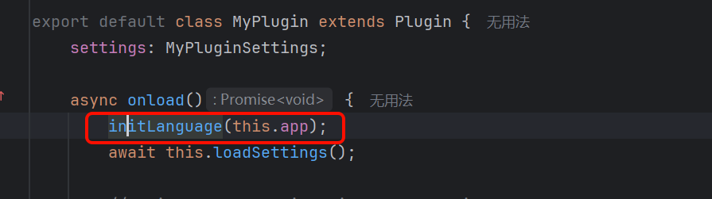
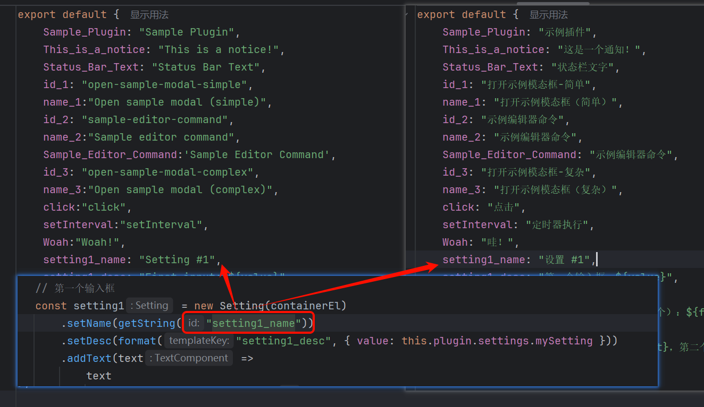

# Obsidian 多语言支持模块

使用方法引入模块
```ts

import { initLanguage, getString ,format} from "./lang";

```
在onload()里面初始化



采取安卓类似id查找资源
```ts
getString("id")

//zh.ts
export default {
	id:"你好"
}
```

具体实现如下


有变量采取

```ts
format("notice_template", {
	first: this.plugin.settings.mySetting,
	second: this.plugin.settings.mySetting2
})
```
